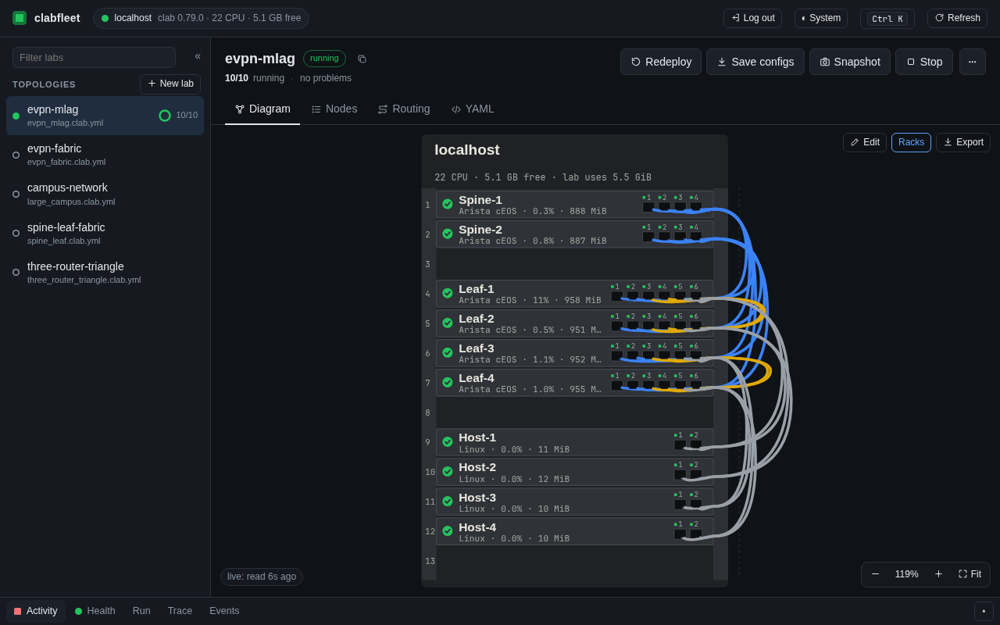

# clabfleet

Deploy and tear down [containerlab](https://containerlab.dev) topologies on
one host — or spread a large topology across a **cluster of hosts** with
automatic, resource-aware placement and VXLAN links between hosts. You can
also generate a topology from a live production network.

Topology files are **standard containerlab files** (`*.clab.yml`). Anything
containerlab accepts works here, and every file in `topologies/` still
deploys with plain `containerlab deploy`.



*The [web GUI](docs/gui.md)'s rack view of `topologies/evpn_mlag.clab.yml`,
running on one host.*

## Features

- **Deploy / destroy / save / inspect** labs locally or on a remote host over SSH
- **Multi-host clusters** — spread nodes across several containerlab servers;
  links between hosts become `vxlan-stitch` links that containerlab creates
  and removes itself
- **Placement strategies** — bin-pack, spread, or resource-based
- **Host pinning & tag affinity** — via ordinary node `labels`
- **Import from live network** — connects to real devices via NAPALM (device
  list from YAML, NetBox, Nautobot or Ansible), pulls running configs and LLDP
  neighbours, and writes a matching containerlab topology: interface names
  mapped per kind, images from rules, optional config sanitising, and
  re-syncs that report changes instead of overwriting
- **Image pre-flight** — fail before anything is created when a node's
  image is missing on its host, or pull it with `--pull`
- **Dry-run** — see the placement plan and the per-host topology files
  without deploying
- **Exec** — run a command on all or some nodes of a lab at once, through
  each kind's CLI, SSH or a shell
- **Lab templates** — generate a spine-leaf, ring or campus lab with
  addressing and routing configs for cEOS, IOL or plain Linux nodes
- **Config snapshots** — copy saved node configs into dated local folders
  and diff them against each other or the topology's `startup-config`
- **Capture** — `tcpdump` on any node interface as a live decode or a pcap
  you can pipe into Wireshark, from the CLI or by clicking a link in the GUI
- **Validate** — check topology files (and placement labels against a
  cluster) without touching any host, e.g. in CI
- **Routing view** — the OSPF areas and adjacencies, BGP sessions and EVPN
  overlay (VTEPs, VNIs, VXLAN tunnels) a lab is built to run, read from its
  startup configs, with inconsistencies between nodes flagged
- **Web GUI** — browse topologies, see live node state on a diagram,
  deploy/destroy with live output, and open CLI/shell/SSH terminals to nodes
  in the browser

## Requirements

- Python 3.11+
- On every lab host: Docker and containerlab
  (`bash -c "$(curl -sL https://get.containerlab.dev)"`)
- Remote hosts: SSH access (key-based recommended). containerlab needs root,
  so either set `sudo: true` (with passwordless sudo for containerlab) or
  add the SSH user to the `clab_admins` group.
- Node images (e.g. Cisco IOL, cEOS) are not public — build or import them on
  each host that will run those nodes.

## Quick start

```bash
pip install -e .

# Deploy on this machine (runs containerlab against the file in place;
# the lab directory clab-<name>/ is created next to it)
clabfleet --sudo deploy topologies/three_router_triangle.clab.yml

# What's running?
clabfleet --sudo inspect topologies/three_router_triangle.clab.yml

# Save running configs into the lab directory
clabfleet --sudo save topologies/three_router_triangle.clab.yml

# Tear it down (add --keep-lab-dir to keep saved configs)
clabfleet --sudo destroy topologies/three_router_triangle.clab.yml
```

## Documentation

| Guide | What it covers |
|-------|----------------|
| [Command line](docs/cli.md) | Waiting for nodes to boot, running commands on nodes, config snapshots and diffs, packet capture, validation, the routing view, lab templates, node images, a remote host, environment variables |
| [Web GUI](docs/gui.md) | The diagram and rack view, terminals, captures, editing topologies, users and roles, logins and sessions |
| [Multi-host cluster deployment](docs/cluster.md) | The cluster inventory, checking hosts, placement strategies and pinning, how links between hosts work |
| [Import from live network](docs/import-live.md) | Device sources, kinds and images, interface names, sanitising configs, re-syncing |
| [Development](docs/development.md) | Running the tests, project structure |

## Example topologies

| File | Description |
|------|-------------|
| `topologies/three_router_triangle.clab.yml` | 3x Cisco IOL routers in a full mesh with OSPF |
| `topologies/spine_leaf.clab.yml` | 2-spine 4-leaf fabric with BGP (Arista cEOS) |
| `topologies/large_campus.clab.yml` | 8-node IOL/IOL-L2 campus with placement labels for multi-host |
| `topologies/evpn_fabric.clab.yml` | 2-spine 4-leaf EVPN/VXLAN fabric (Arista cEOS): eBGP underlay, EVPN overlay, L2 and L3 VNIs, 4 Linux hosts |
| `topologies/evpn_mlag.clab.yml` | The same fabric with the leaves as two MLAG pairs (peer-links, one shared VTEP per pair) and 4 hosts dual-homed with LACP bonds |
| `topologies/cluster.yaml` | 3-host cluster inventory |
| `topologies/live_devices_example.yaml` | Device inventory for live network export |

## License

MIT — see [LICENSE](LICENSE).
