# A tour of the GUI

Screens of the web GUI, taken from a running lab: the EVPN MLAG example
(`topologies/evpn_mlag.clab.yml`, six Arista cEOS switches and four Linux
hosts) and the campus example. [Web GUI](gui.md) describes each part.

## Start page

The topologies in the workspace, each with a thumbnail and its state, and
ways to start a new lab: a blank canvas or a template.

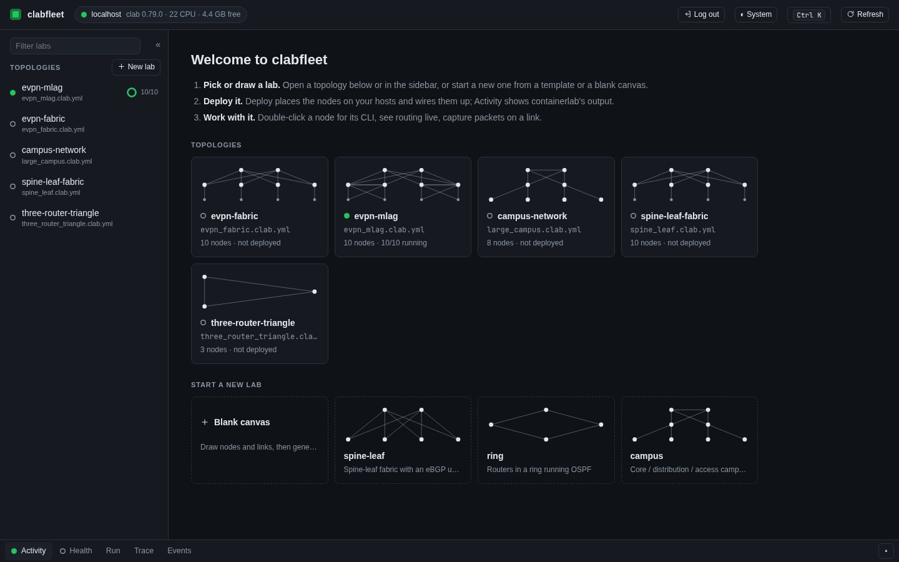

## Diagram and inspector

The lab as a diagram with live node and link state. Selecting a node opens
the inspector: its state, CPU and memory, and every interface with its
address, its peer, its live state and what runs on it.

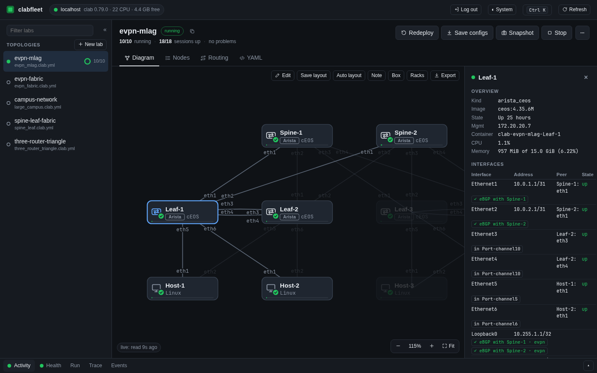

The light theme (there is also a high-contrast one):

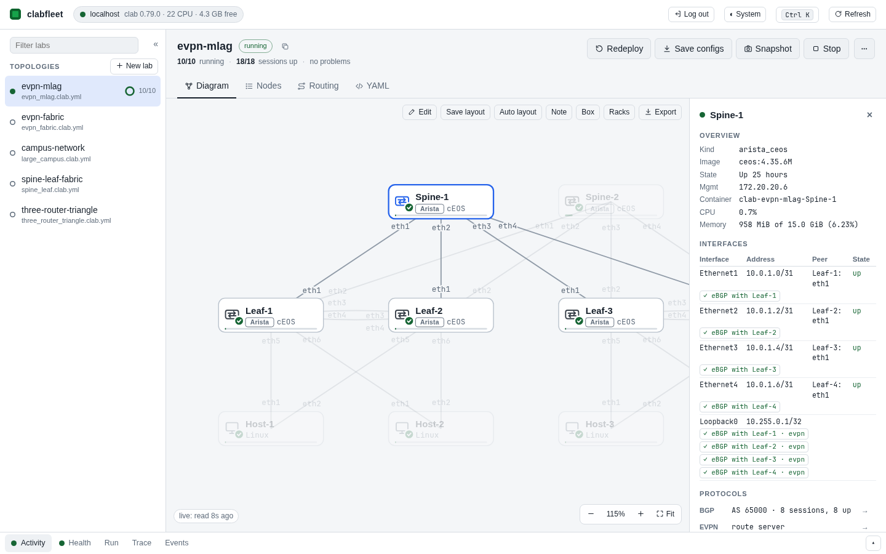

## Rack view

Each host as a rack, each node a device with its ports and link LEDs, and
a cable per link coloured by its role.

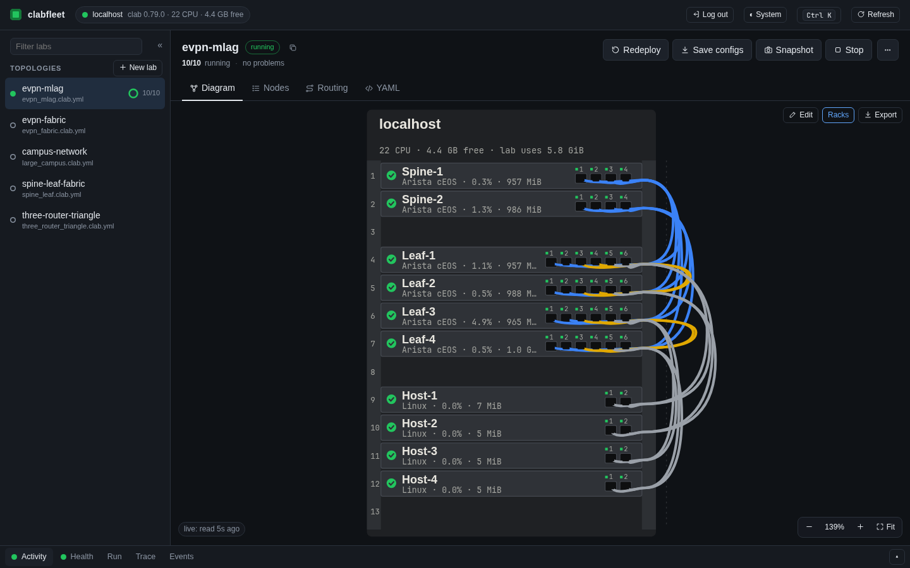

## Routing

The routing design read from the nodes' startup configs, one view per
protocol, with the live state of the running lab over it.

EVPN: the route servers, the VTEPs, and the VXLAN tunnels between VTEPs
that share a VNI. The card shows a VTEP's VNIs with their RDs and RTs.

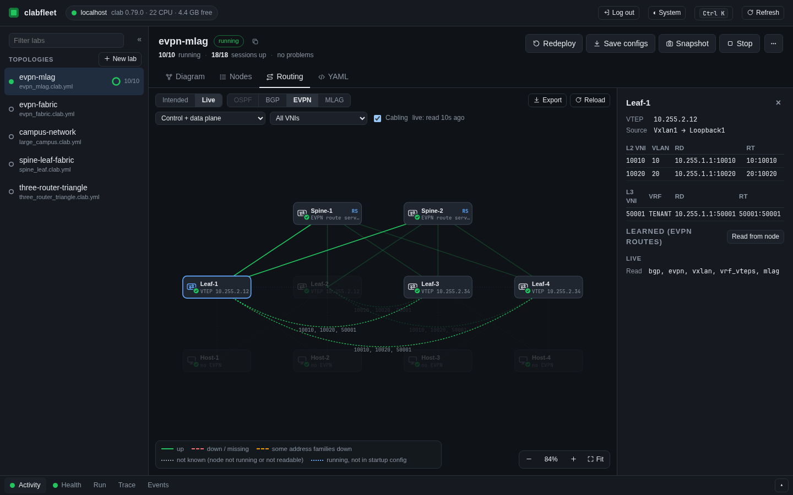

BGP: routers grouped by AS, sessions with their address families and
state.

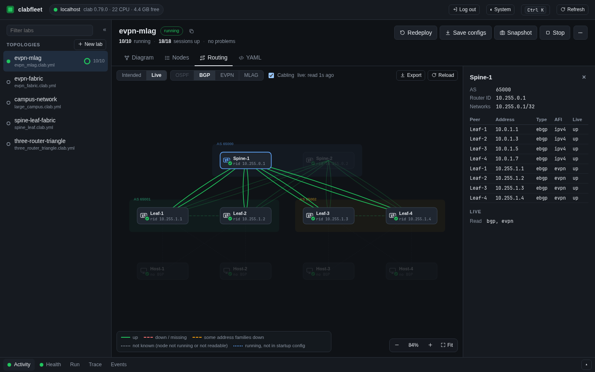

OSPF, on a lab that is not deployed: the design alone, with what does not
add up between the configs.

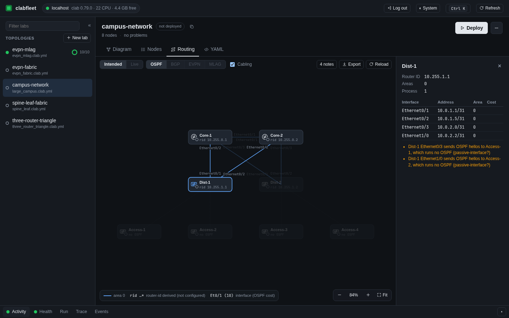

## Path trace

Where traffic from one node to another goes, hop by hop, read from the
nodes' own tables: every equal-cost branch, and VXLAN between VTEPs. The
path is drawn on the diagram.

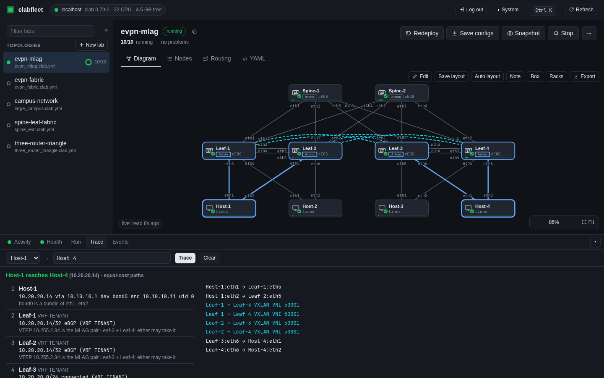

## Terminals

A node's CLI, shell or logs in a tab, next to the diagram.

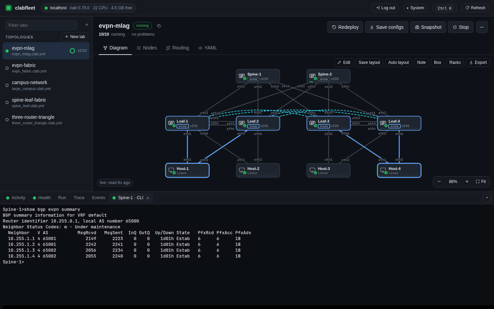

## Hosts

Each lab host with its memory in use, the vCPU counted for its running
labs, and the labs on it.

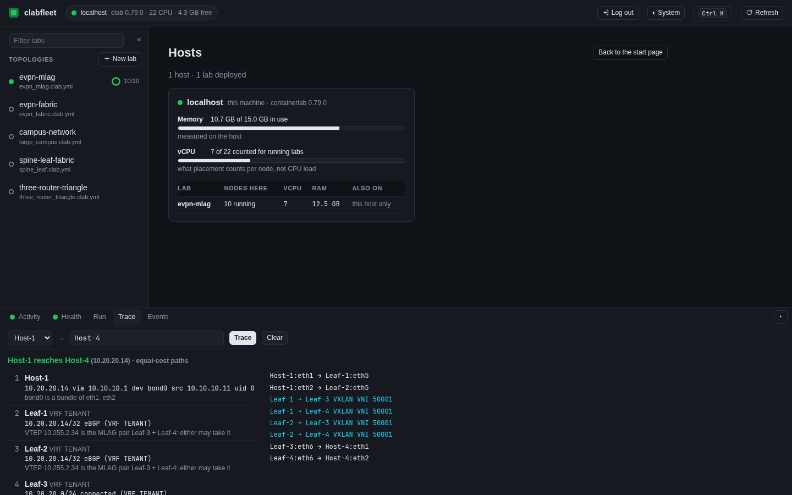

## Drawing a lab

Edit mode on the diagram: drag kinds onto the canvas, link nodes by
dragging between them, generate their configs.

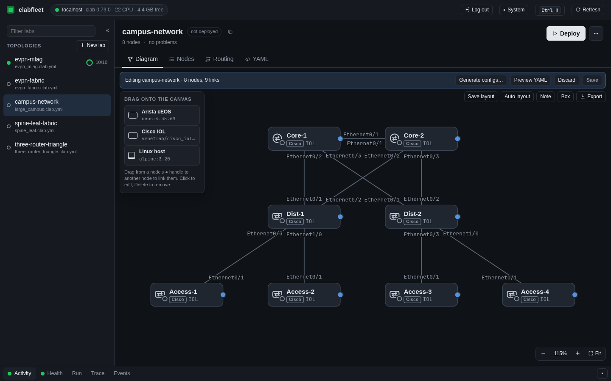

## Logging in

Named users with operator and viewer roles, and logins through OpenID
Connect or LDAP / Active Directory. (The provider and directory named on
this screen are stand-ins.)

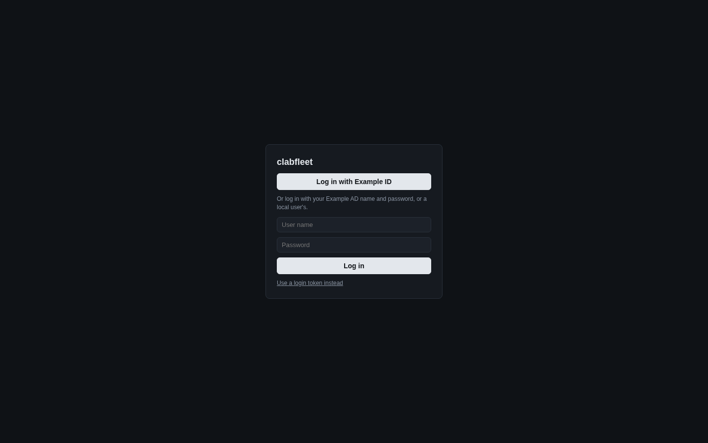
